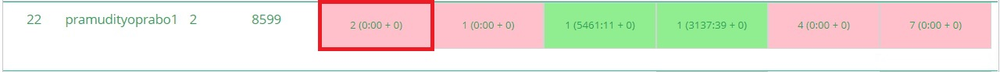
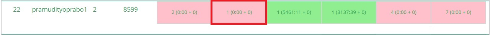
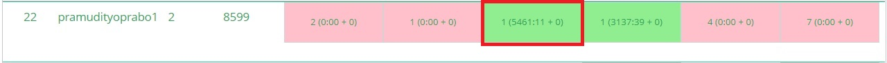
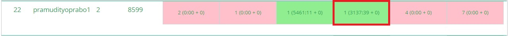
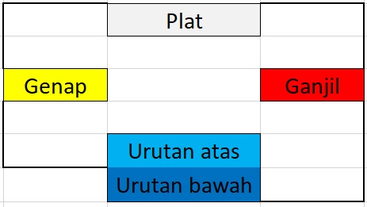
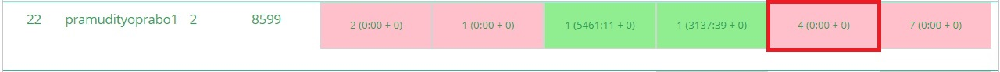

# Struktur Data H Praktikum 1 2021
## Cari Tanah
### Verdict
Terminated due to timeout
#### Bukti

### Penjelasan Soal
Diminta untuk menentukan ada atau tidaknya lokasi petak sesuai dengan denah yang di input
### Penjelasan Solusi

## Malur Rajin
### Verdict
Wrong Answer
#### Bukti

### Penjelasan Soal
Diminta untuk menentukan jumlah buku yang malur harus pisahkan dengan diikuti nama buku
### Penjelasan Solusi

## Garasi Mobil Saha
### Verdict
AC saat Revisi
#### Bukti

### Penjelasan Soal
Diminta untuk menentukan apakah mobil pertama yang masuk garasi berhasil keluar ketika jadwalnya telah tiba tanpa melebihi batas mobil yang ada di garasi, dengan kata lain tidak boleh ada mobil yang masuk tanpa ada mobil yang keluar jika garasi sudah penuh
### Penjelasan Solusi
Program akan meminta untuk menginput batas test case, jumlah mobil, dan kapasitas garasi. Lalu program akan meminta jadwal masuk dari mobil dan jadwal keluar. Jika jadwal mobil masuk tidak bersamaan dengan mobil keluar ketika garasi penuh, maka `ganti_garasi` dirubah menjadi true lalu output program akan berupa *Hmm harus renovasi garasi nich*. Jika tidak, mobil yang masuk akan di masukkan ke `Mobil_baru`. Urutan mobil akan dicek, bila mobil berada di bagian terluar dan memang sudah jadwal nya keluar, mobil akan dikeluarkan. Jika ada mobil yang masuk dan garasi belum penuh, garasi akan diisi dengan mobil baru. Kedua urutan tersebut akan berulang sesuai dengan `Jam_sekarang` sampai hari habis. Jika sampai habis `ganti_garasi` berupa false, output berupa *Hore gausah renov garasi*.
### Visualisasi Solusi

## Genjil Ganap
### Verdict
AC saat revisi
#### Bukti

### Penjelasan Soal
Diminta untuk mengurutkan plat mobil Roy berdasarkan Ganjil dan Genap plat mobil, Genap di depan dan Ganjil di belakang
### Penjelasan Solusi
Pertama program akan meminta input untuk jumlah plat yang diinginkan `n`, lalu program akan meminta plat yang dimiliki sebanyak `n`. Jika plat yang dimasukkan berupa Genap, plat akan dimasukkan kedalam Queue `genap.push(plat)`, sementara jika plat berupa ganjil, plat akan dimasukkan ke Stack `ganjil.push(plat)`. Setelah semua plat dimasukkan, proses untuk mengeluarkan plat dari queue dilakukan `genap.pop()`, setelah Queue habis, baru plat dari stack dikeluarkan `ganjil.pop()`
### Visualisasi Solusi

## Bread Problemo
### Verdict
Wrong Answer
#### Bukti

### Penjelasan Soal
Diminta untuk menggambarkan pemindahan roti oleh ibu dengan output roti yang telah dipindahkan apakah sesuai dengan permintaan Ray atau tidak
### Penjelasan Solusi

## Nadut & Cayo
### Verdict
Wrong Answer
#### Bukti

### Penjelasan Soal
Diminta untuk menyusun balok berdasarkan angka, jika angka sebelumnya lebih kecil, angka sebelum nya sampai angka pertama dihapus dan diganti dengan angka yang baru
### Penjelasan Solusi
Program akan meminta input berupa banyaknya Testcase, Banyak Digit yang diinginkan, dan isi dari digit berupa `buffer`. Program akan mengecek apabila `angka` tidak kosong, dan `buffer` lebih besar daripada `angka`, maka isi dari `angka` akan di keluarkan. Jika tidak, maka `buffer` akan dimasuk kan ke dalam `angka`. Jika digit yang dimasukkan sudah habis, maka `angka` akan di keluarkan 1 1 lalu di input kedalam program, lalu program akan berlanjut ke testcase selanjutnya.
